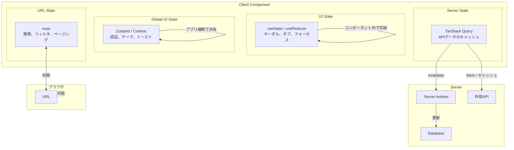
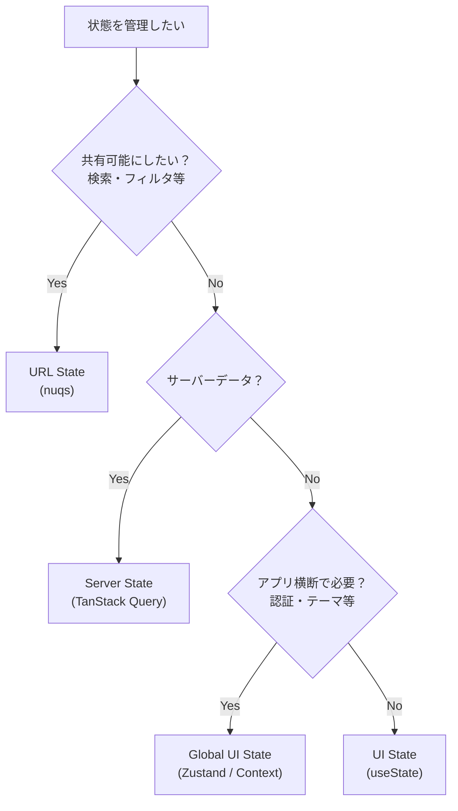

# 状態管理ルール

このドキュメントは Next.js プロジェクトにおける状態管理のルールを定義する。

**原則**: 状態は「効力を持つ最小スコープ」に置く。

## 状態の分類

| 分類            | 管理方法              | 例                     |
| --------------- | --------------------- | ---------------------- |
| UI State        | useState / useReducer | モーダル開閉、タブ選択 |
| Global UI State | Zustand / Context     | 認証、テーマ、トースト |
| Server State    | TanStack Query        | API データ             |
| URL State       | nuqs                  | 検索条件、ページング   |

## UI State

コンポーネント内部のインタラクション状態。

**原則**: ローカル > Props > Context（最終手段）

**理由**: スコープが小さいほど依存が減り、意図しない再描画を防げる。

### ローカル state（useState / useReducer）

- モーダル・ドロワーの開閉
- タブの選択状態
- ホバー・フォーカス状態
- 入力補助 UI の表示制御

**禁止**: UI State をグローバルに置かない。

### Props

- 親の UI 状態を子が参照する場合のみ使用

### Context

- Props のバケツリレーが破綻する場合の最終手段

## Global UI State

アプリ横断で共有が必要な UI 状態。Zustand または Context で管理する。

### グローバルに置いてよいもの

- 認証情報（user, role）
- テーマ（dark / light）
- トースト・通知の状態
- ビューポート情報

**原則**: 上記以外はグローバルに置かない。

**理由**: グローバルは再描画範囲が広く、責務が曖昧になりやすい。

## Server State

API から取得するデータ。TanStack Query で管理する。

**原則**: サーバーデータを UI State に保持しない。

**理由**: キャッシュ・再フェッチ・エラー管理を Query に任せられる。

### Server Actions との使い分け

- データ取得: TanStack Query
- データ更新: Server Actions + invalidateQueries

## URL State

共有可能な状態。nuqs で管理する。

**原則**: URL は「共有したい状態」のみ。

**理由**: URL は入力値であり、結果（データ）は Server State が担当する。

### URL に保存するもの

- 検索条件
- フィルタ
- ソート
- ページネーション
- 意味を持つ ID（タブ切替等）

### URL に保存しないもの

- 確認ダイアログやフォームなど一時的な UI 状態
- 共有する意味のないモーダル

## 俯瞰図

## 選択フロー

