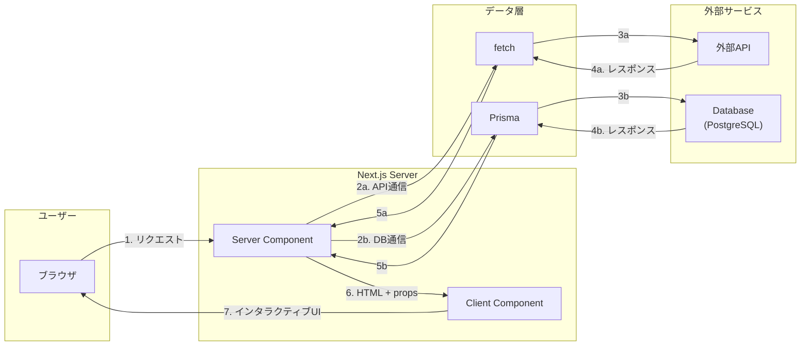
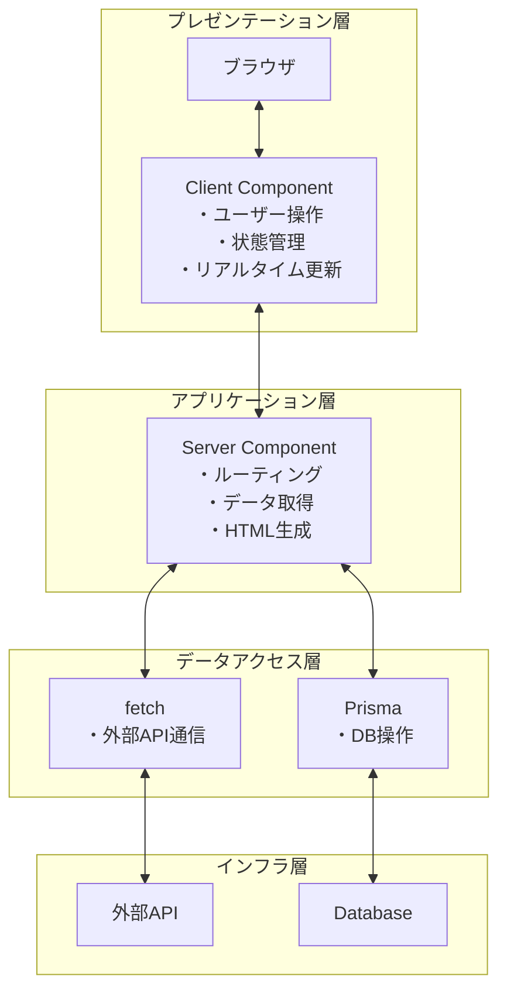
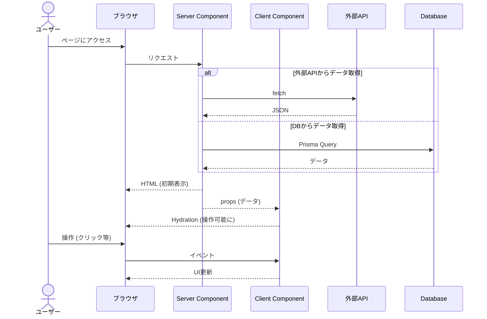

# アーキテクチャ概要

このドキュメントはユーザーがページを表示するまでのデータフローとレイヤー別の責務を図解する。

## 全体フロー

```mermaid
flowchart LR
    subgraph User["ユーザー"]
        Browser["ブラウザ"]
    end

    subgraph NextServer["Next.js Server"]
        SC["Server Component"]
        CC["Client Component"]
    end

    subgraph DataLayer["データ層"]
        Fetch["fetch"]
        Prisma["Prisma"]
    end

    subgraph External["外部サービス"]
        API["外部API"]
        DB["Database<br/>(PostgreSQL)"]
    end

    Browser -->|1. リクエスト| SC
    SC -->|2a. API通信| Fetch
    SC -->|2b. DB通信| Prisma
    Fetch -->|3a| API
    Prisma -->|3b| DB
    API -->|4a. レスポンス| Fetch
    DB -->|4b. レスポンス| Prisma
    Fetch -->|5a| SC
    Prisma -->|5b| SC
    SC -->|6. HTML + props| CC
    CC -->|7. インタラクティブUI| Browser
```

## レイヤー別責務

```mermaid
flowchart TB
    subgraph Presentation["プレゼンテーション層"]
        direction LR
        Browser["ブラウザ"]
        CC["Client Component<br/>・ユーザー操作<br/>・状態管理<br/>・リアルタイム更新"]
    end

    subgraph Application["アプリケーション層"]
        direction LR
        SC["Server Component<br/>・ルーティング<br/>・データ取得<br/>・HTML生成"]
    end

    subgraph Data["データアクセス層"]
        direction LR
        Fetch["fetch<br/>・外部API通信"]
        Prisma["Prisma<br/>・DB操作"]
    end

    subgraph Infrastructure["インフラ層"]
        direction LR
        API["外部API"]
        DB["Database"]
    end

    Browser <--> CC
    CC <--> SC
    SC <--> Fetch
    SC <--> Prisma
    Fetch <--> API
    Prisma <--> DB
```

## データの流れ

```mermaid
sequenceDiagram
    actor User as ユーザー
    participant Browser as ブラウザ
    participant SC as Server Component
    participant CC as Client Component
    participant API as 外部API
    participant DB as Database

    User->>Browser: ページにアクセス
    Browser->>SC: リクエスト

    alt 外部APIからデータ取得
        SC->>API: fetch
        API-->>SC: JSON
    else DBからデータ取得
        SC->>DB: Prisma Query
        DB-->>SC: データ
    end

    SC-->>Browser: HTML (初期表示)
    SC-->>CC: props (データ)
    CC-->>Browser: Hydration (操作可能に)

    User->>Browser: 操作 (クリック等)
    Browser->>CC: イベント
    CC-->>Browser: UI更新
```
